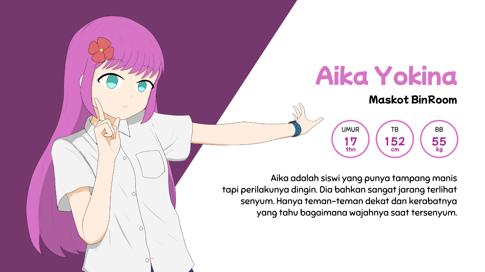
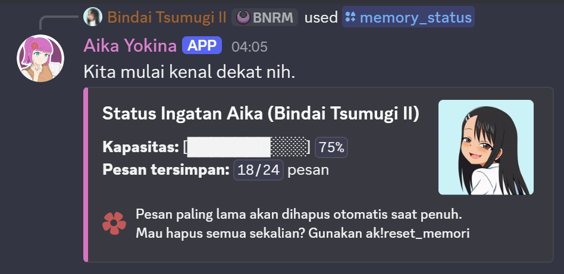
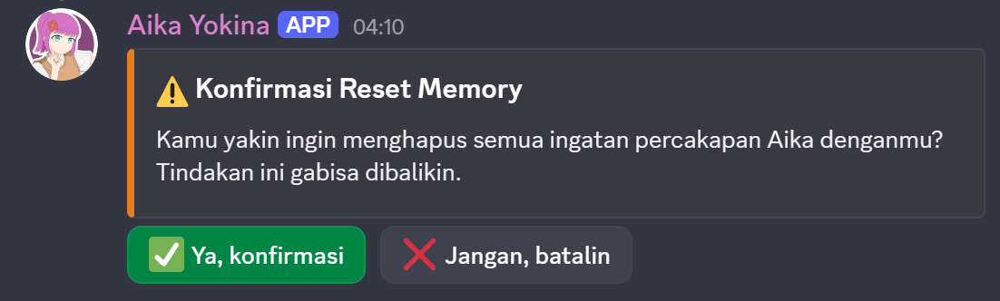
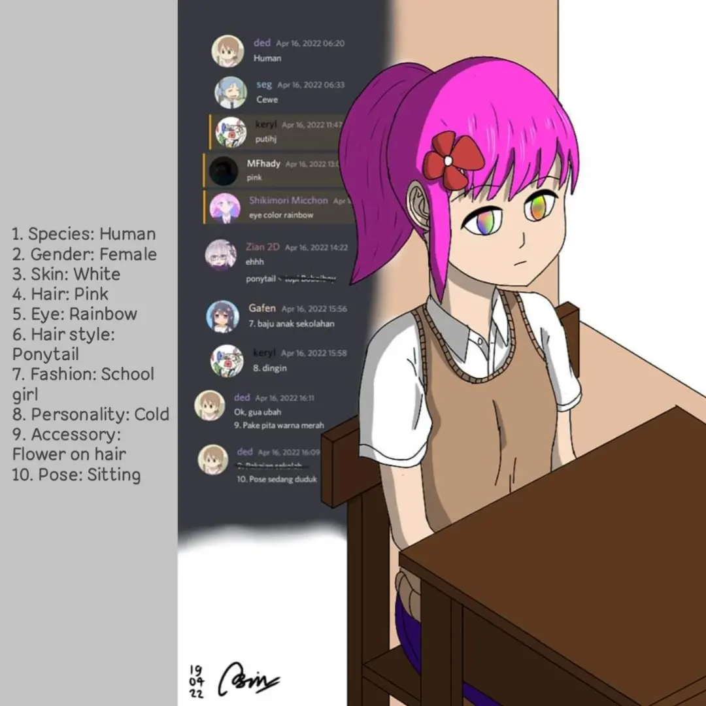
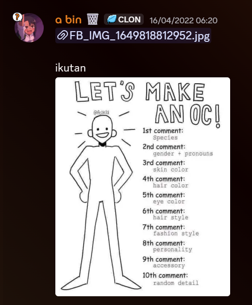
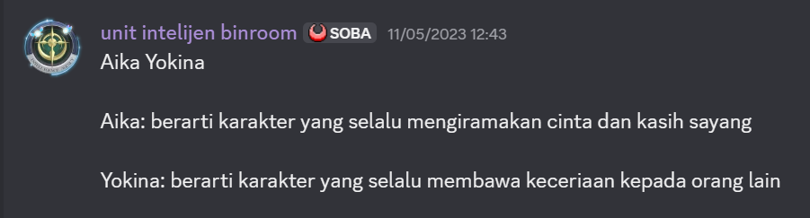

# Aika Yokina, BinRoom Mascot Discord Bot

---
<div align="center">
	
	<p><i><small>Digambar dan didesain oleh Bindai Tsumugi; gambar dikomisi oleh Aioi</small></i></p>
</div>

<table border="0" cellspacing="0" cellpadding="0" align="center" width="700px" style="border:none !important; border-collapse:collapse; margin:0 auto;">
  	<tr style="border:none !important;">
    	<td align="center" valign="middle" style="border:none !important; padding:5px;">
      		
    	</td>
    	<td rowspan="2" align="center" valign="middle" style="border:none !important; padding=5px 0px 0px 0px;">
      		
    	</td>
  	</tr>
  	<tr style="border:none !important;">
    	<td align="center" valign="middle" style="border:none !important; padding:5px;">
      		
    	</td>
  	</tr>
</table>


<p align="center" style="margin-top:20px">
	<small>
		Kunjungi kami: 
		<a href="https://binroom.carrd.co/">
			
		</a>
		  |  Lisensi:
		<a>
			
		</a>
	</small>
</p>

### Ringkasan
Repositori ini berisi source code, alias isi kodingan dari bot ini. 
Bot Aika Yokina adalah bot yang berperan sebagai maskot/OC (original character) di 	server BinRoom. Tujuan dia dibuat yaitu untuk memperkuat representasi dirinya sebagai maskot server, sekaligus agar dia terkesan lebih dekat dengan para member, khususnya dengan kehadirannya di deretan member list, dan menjadi penyaji info utama pada halaman awal server.

### Tupoksi
Selain tujuan pembuatannya, Aika juga punya dua tugas utama. Dia punya tugas khusus menjaga channel ranjau/honeypot khusus untuk mencegat akun-akun berbahaya yang mencoba membombardir link kripto/phishing/scam (khususnya yang foto X-nya Elon atau MrBeast). Selain itu, Aika juga punya fitur AI chatbot yang bisa diajak ngobrol di channel khusus. Fitur ini diciptakan khusus agar Aika terasa lebih dekat dengan para member.

---
### Fitur khusus: AI roleplay chatbot
Aika punya fitur AI roleplay chatbot yang ditenagai oleh [Groq Qwen 3.6 27B](https://qwen.ai/blog?id=qwen3.6-27b). Pada channel khusus dalam server (atau bisa juga di-@mention jika di luar channel-nya), Aika akan merespons chat pengguna dan membalas sesuai kepribadiannya. Pengadaan fitur ini diharapkan agar bisa membawa maskot/OC fiksi ini lebih dekat dengan server dan para member, sekaligus memperkuat perwujudannya sebagai OC server. 

Berkat fitur Qwen 3.6 27B, Aika bisa merespons pesan teks dan gambar. Jika user menyertakan attachment ke dalam pesannya, Aika bisa memproses medianya dan membalas sesuai foto yang dikasih. Pendekatan ini sangat cocok untuk mereaksi pesan-pesan seperti memperlihatkan fan art ke Aika, atau screenshot gameplay, dll. 

#### Command pada roleplay yang bisa digunakan (support prefiks `ak!` dan slash `/`):
- `memory_status`: mengecek kapasitas memori Aika (ingatannya) tentangmu. 
Dikarenakan keterbatasan varian gratisan dari Groq, Aika dibatasi hanya bisa menyimpan 24 pesan per orang. Jika kapasitas penuh, chat paling lama akan otomatis dihapus saat ada chat baru masuk.
<div align="center" style="margin-left: 30px;">
	
</div>

- `reset_memori`: menghapus seluruh riwayat percakapan dengan Aika
<div align="center" style="margin-left: 30px;">
	
</div>

---
### Info umum tentang Aika

<p align="center">
	<table border="0" cellspacing="0" cellpadding="0" align="center" style="border:none !important; border-collapse:collapse; margin:0 auto;">
		<tr style="border:none !important;">
			<td align="center" valign="middle" style="border:none !important; padding:0 10px;">
				
			</td>
			<td align="center" valign="middle" style="border:none !important; padding:0 10px;">
				
			</td>
		</tr>
	</table>
</p>

<p align="center">
	<small>
		<i>Kiri: ilustrasi awal Aika Yokina beserta chat para member kontributor
		<br>
		Kanan: chat owner saat menginisiasi tantangan</i>
	</small>
</p>

Aika Yokina adalah OC server yang tercipta dari hasil kreasi bersama. Pada April 2022, owner mencoba tantangan menggambar online 'Let's Make an OC Challenge.' Dari kesepuluh kategori, masing-masing diisi oleh para member. Kategorinya antara lain:

1. Spesies: manusia (Yoga)
2. Jenis kelamin: perempuan (Yogi)
3. Warna kulit: putih (Anwar)
4. Warna rambut: pink (Hadi)
5. Warna mata: pelangi (Gilang, kemudian diubah ke biru toska oleh owner)
6. Gaya rambut: ponytail (Zian)
7. Pakaian: seragam sekolah (Gafen)
8. Kepribadian: dingin (Anwar)
9. Aksesoris: hairclip merah (Yoga)
10. Pose pada ilustrasi awal: duduk (Yoga)

Dari sintesis inilah tercipta Aika, seorang maskot/OC yang punya esensi nyata milik bersama, dan ditetapkan sebagai representasi server BinRoom.

### Asal usul nama Aika Yokina
Nama Aika Yokina digagas oleh Ilham/ZeoTrix dengan filosofi: Aika berarti karakter yang selalu mengiramakan cinta dan kasih sayang, Yokina berarti karakter yang selalu membawa keceriaan pada orang lain.

<div align="center">
	
	<p><i>Screenshot chat filosofi nama Aika Yokina yang digagas oleh Ilham ZeoTrix</i></p>
</div>

Meski tampak bertolak belakang dengan sikap dinginnya, dia tidak berarti kejam, kok. Dari dalam, dia masih perhatian dan punya hati. 

----
### Info hosting
Bot Aika di-hosting di [Wispbyte](https://wispbyte.com/) menggunakan tier gratisan. Layanan ini dipilih karena mereka menawarkan free tier yang gratis terus-menerus dan dijamin online 24/7 dengan uptime 95-99%, cocok untuk Aika yang berjaga di channel ranjau/honeypot server.

---

## Mau Jalanin Bot-nya Sendiri? Berikut Instalasinya

### Persyaratan
- Python 3.10 atau lebih baru
- Token bot Discord (salin dari [Discord Developer Portal](https://discord.com/developers/home) di menu bot-mu)
- API key Groq (untuk fitur AI chatbot)
- Kredensial API Sightengine (untuk moderasi konten)

### Pengaturan

1. **Klon repositori**
   ```bash
   git clone https://github.com/AbinDai/Aika-Yokina-BinRoom-Mascot-Discord-Bot.git
   cd Aika-Yokina-BinRoom-Mascot-Discord-Bot
   ```

2. **Buat virtual environment**
   ```bash
   python -m venv .venv
   # Di Windows:
   .venv\Scripts\activate
   # Di Unix/macOS:
   source .venv/bin/activate
   ```

3. **Install dependensi**
   ```bash
   pip install -r requirements.txt
   ```

4. **Konfigurasi environment variables**
   ```bash
   cp .env.example .env
   ```
   Edit `.env` dan isi nilai yang diperlukan:
   - `TOKEN_BOT`: Token bot Discord Anda
   - `GROQ_API_KEY`: API key Groq Anda
   - `SIGHTENGINE_USER`: User ID Sightengine Anda
   - `SIGHTENGINE_SECRET`: API secret Sightengine Anda
   - Dan nilai konfigurasi lainnya sesuai kebutuhan

5. **Jalankan bot**
   ```bash
   python bot.py
   ```

## Pengembangan

Lihat [CONTRIBUTING.id.md](CONTRIBUTING.id.md) untuk panduan pengembangan.

---
<p align="center"><small>© 2022-2026 BinRoom & Bindai Tsumugi. Hak cipta dilindungi undang-undang.</small></p>
